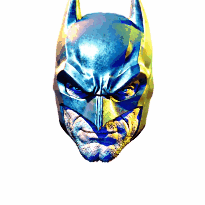
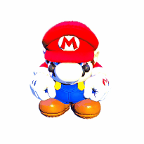
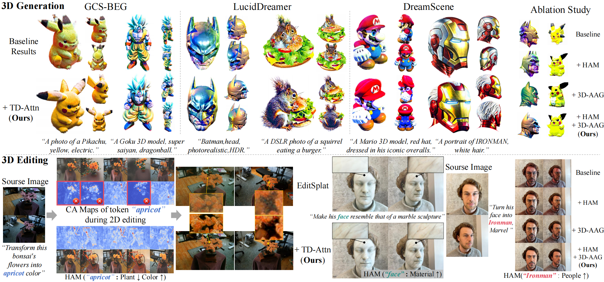
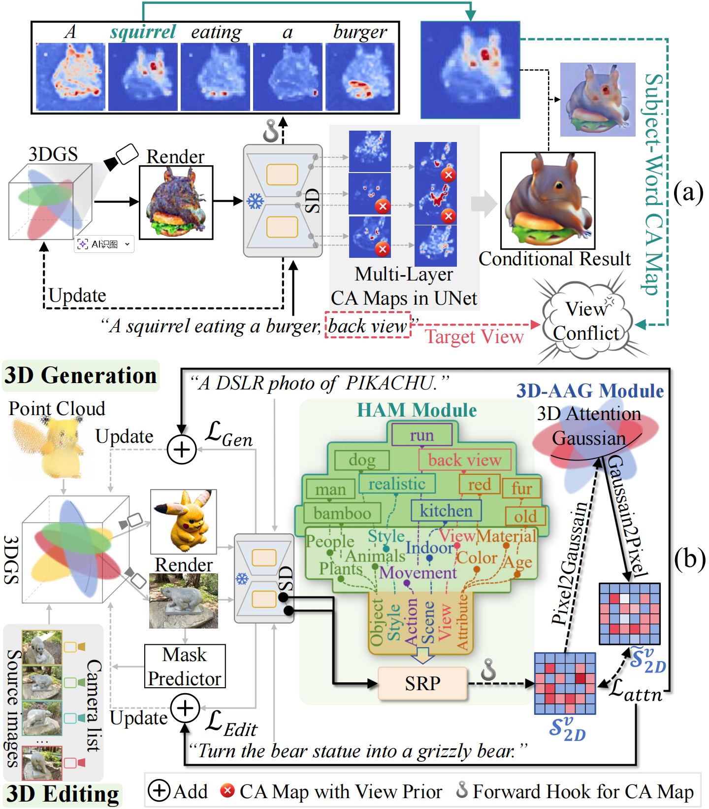
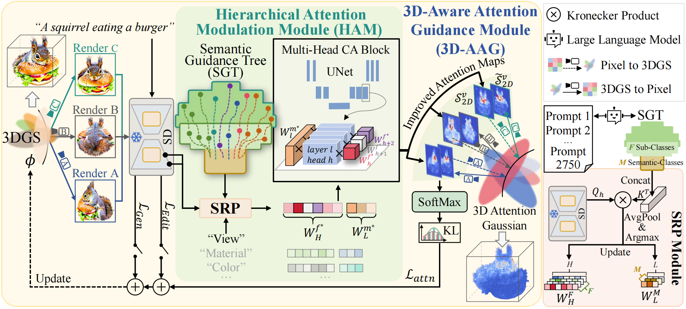

# [AAAI 2026] Debiasing Diffusion Priors via 3D Attention for Consistent Gaussian Splatting


<div align="center">
  <table>
    <tr>
      <td width="300">
        
      </td>
      <td>
        <h2>📢 News</h2>
        <ul>
          <li><strong>[2025.12.8]</strong> We released the paper <a href="https://arxiv.org/pdf/2512.07345" target="_blank"></a></li>
          <li><strong>[2025.12.8]</strong> We released codes.</li>
          <li><strong>[2025.11.08]</strong> 🎉🎉 Our paper <strong>"Debiasing Diffusion Priors via 3D Attention for Consistent Gaussian Splatting"</strong> has been <strong>accepted to AAAI 2026</strong>!</li>
        </ul>
      </td>
    </tr>
  </table>
</div>


---

## 🎬 **Showcase Gallery**

<div align="center">

|                🦸‍♂️ Superheroes                 | 🎮 Anime Characters | 🐾 Adorable Creatures |
|:------------------------------------------------:|:---:|:---:|
|   |  |  |
|                    **Batman**                    | **Goku** | **Pikachu** |
|  |  |  |
|                   **Iron Man**                   | **Mario** | **Squirrel** |

</div>

---

## 🔥 **What Makes TD-Attn Special?**

<div align="center">
  
</div>

### 🚀 **Key Innovations**

- **🎯 Universal Plugin**: Works seamlessly across different 3D generation frameworks
- **🔍 3D-Aware Attention**: Eliminates prior view bias through spatial consistency
- **🎨 Controllable Editing**: Semantic-specific interventions for precise 3D modifications
- **📐 Multi-View Consistency**: Coherent appearance across all viewing angles

---

## 📋 **Abstract**

<details>
<summary><strong>🔬 Click to explore the technical details</strong></summary>

We propose a **universal framework** that eliminates prior view bias in diffusion models to achieve **multi-view consistent 3D generation and editing**.

Versatile 3D tasks (e.g., generation or editing) distilling Text-to-Image (T2I) diffusion models have attracted significant research interest for not relying on extensive 3D training data. However, T2I models exhibit limitations resulting from **prior view bias**, which produces conflicting appearances between different views of an object. 

This bias causes subject-words to preferentially activate prior view features during cross-attention (CA) computation, regardless of the target view condition. To overcome this limitation, we conduct a comprehensive mathematical analysis to reveal the root cause of the prior view bias in T2I models.

**Our Solution - TD-Attn Framework:**

🔹 **3D-Aware Attention Guidance Module (3D-AAG)**: Constructs view-consistent 3D attention Gaussians for spatial consistency

🔹 **Hierarchical Attention Modulation Module (HAM)**: Uses semantic guidance trees for precise CA layer modulation

The result? **Transformative multi-view consistency** across a wide range of 3D tasks!

</details>

---

## 🏗️ **Architecture Overview**

<div align="center">
  
   
</div>

---

## ⚡ **Quick Start**

### 🛠️ **Environment Setup**

#### 1️⃣ Create Conda Environment
```bash
conda create -n TDATTN python=3.9.16 cudatoolkit=11.8
conda activate TDATTN
```

#### 2️⃣ Install Dependencies
```bash
pip install -r requirements.txt
```

**Requirements:**
- 🐍 Python 3.9.16
- 🚀 CUDA 11.7+
- 🔥 PyTorch 2.0.1

---

## 🎮 **Usage Examples**

### 🌟 **3D Generation**

Choose your preferred framework:

```bash
# Option 1: LucidDreamer + TD-Attn
cd LucidDreamer-TDATTN
bash run.sh
```

```bash
# Option 2: GCS-BEG + TD-Attn  
cd GCS-BEG-TDATTN
bash run.sh
```

```bash
# Option 3: DreamScene + TD-Attn
cd DreamScene-TDATTN
bash run.sh
```

### ✂️ **3D Editing**

```bash
cd Editsplat-TDATTN
bash run.sh
```

---

## 🎯 **Key Features**

| Feature | Description | Benefit |
|---------|-------------|---------|
| 🔄 **Multi-View Consistency** | Eliminates conflicting appearances across views | Professional-quality 3D assets |
| 🎨 **Controllable Editing** | Semantic-specific interventions | Precise modifications without artifacts |
| 🔌 **Universal Plugin** | Compatible with existing frameworks | Easy integration into your workflow |
| 📊 **Mathematical Foundation** | Comprehensive analysis of view bias | Robust and reliable results |

---

## 🙏 **Acknowledgements**

This work builds upon incredible contributions from the open-source 3D generation community:

### 🌟 **Core Frameworks**
- **LucidDreamer** - High-quality 3D generation framework
- **GCS-BEG** - Gaussian splatting techniques  
- **DreamScene** - Scene generation capabilities
- **EditSplat** - 3D editing framework

### 🔧 **Technical Components**
- **HRV** - View synthesis techniques
- **P2P** - Prompt-to-prompt editing methods

We thank all researchers and developers who made these open-source frameworks available to the community.

---
